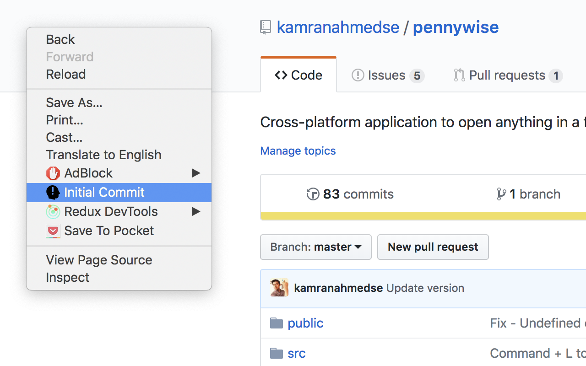

# git-first
> Chrome Extension – Takes you to the first commit of a GitHub repository

Adds a menu item under the right click whenever you are on any Github Repository page. Clicking it will take you to the first commit of the repository; allowing you to look at how it all started.

## Install

Install it from the [Chrome Web Store](https://chrome.google.com/webstore/detail/git-first/bkodimdeilmanedhmadkjickmfobpjde) or [manually](http://superuser.com/a/247654/6877)

## Contributions

Feel free to submit pull requests, create issues or spread the word.

## License

MIT © [Kamran Ahmed](https://twitter.com/kamranahmedse)

haider iqbal khan

